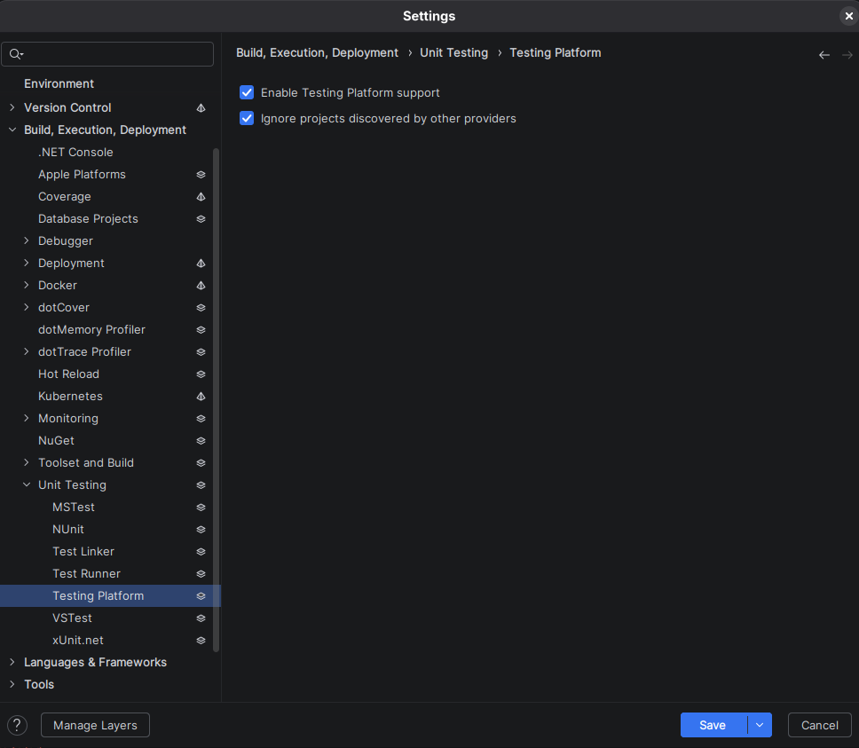

# Purpose
Quick and small reproduction repo for a flaky test behavior regarding FastEndpoints and TUnit parallelism.

## Failure description

First off: the tests usually pass, but they show a flaky behavior when run multiple times.
The test/s fails with the following error:
```
[Null Reference] Object reference not set to an instance of an object.
   at System.Text.Json.Serialization.Metadata.JsonTypeInfoResolverChain.GetTypeInfo(Type type, JsonSerializerOptions options)
   at System.Text.Json.Serialization.Metadata.JsonTypeInfoResolverWithAddedModifiers.GetTypeInfo(Type type, JsonSerializerOptions options)
   at System.Text.Json.JsonSerializerOptions.GetTypeInfoNoCaching(Type type)
   at System.Text.Json.JsonSerializerOptions.CachingContext.CreateCacheEntry(Type type, CachingContext context)
--- End of stack trace from previous location ---
   at System.Text.Json.JsonSerializer.GetTypeInfo[T](JsonSerializerOptions options)
   at System.Text.Json.JsonSerializer.GetTypeInfo[T](JsonSerializerOptions options)
   at System.Text.Json.JsonSerializer.Serialize[TValue](TValue value, JsonSerializerOptions options)
   at System.Text.Json.JsonSerializer.Serialize[TValue](TValue value, JsonSerializerOptions options)
   at FastEndpoints.HttpClientExtensions.ToContent[TRequest](TRequest request)
   at FastEndpoints.HttpClientExtensions.SENDAsync[TRequest,TResponse](HttpClient client, HttpMethod method, String requestUri, TRequest request, Boolean sendAsFormData, Boolean populateHeaders, Boolean populateCookies)
   at System.Text.Json.JsonSerializer.Serialize[TValue](TValue value, JsonSerializerOptions options)
   at FastEndpoints.HttpClientExtensions.SENDAsync[TRequest,TResponse](HttpClient client, HttpMethod method, String requestUri, TRequest request, Boolean sendAsFormData, Boolean populateHeaders, Boolean populateCookies)
   at FastEndpoints.HttpClientExtensions.ToContent[TRequest](TRequest request)
   at FastEndpoints.HttpClientExtensions.SENDAsync[TRequest,TResponse](HttpClient client, HttpMethod method, String requestUri, TRequest request, Boolean sendAsFormData, Boolean populateHeaders, Boolean populateCookies)
   at FastEndpoints.HttpClientExtensions.POSTAsync[TEndpoint,TRequest](HttpClient client, TRequest request, Boolean sendAsFormData, Boolean populateHeaders, Boolean populateCookies)
   at Api.Tests.TUnit.Features.Todos.CreateTests.Should_Create_Todo() in /home/drcox1911/Coding/projects/TestReproFE/Api.Tests.TUnit/Api.Tests.TUnit/Features/Todos/CreateTests.cs:line 19
   at Api.Tests.TUnit.Features.Todos.CreateTests.Should_Not_Create_Todo_InvalidTitle() in /home/drcox1911/Coding/projects/TestReproFE/Api.Tests.TUnit/Api.Tests.TUnit/Features/Todos/CreateTests.cs:line 33
   at TUnit.Core.TestMetadata`1.<>c__DisplayClass14_0.<<get_CreateExecutableTestFactory>b__2>d.MoveNext()
--- End of stack trace from previous location ---
   at TUnit.Engine.TestExecutor.ExecuteTestAsync(AbstractExecutableTest executableTest, CancellationToken cancellationToken)
   at TUnit.Core.ExecutableTest.InvokeTestAsync(Object instance, CancellationToken cancellationToken)
   at TUnit.Engine.TestExecutor.ExecuteTestAsync(AbstractExecutableTest executableTest, CancellationToken cancellationToken)
   at TUnit.Engine.Helpers.TimeoutHelper.<>c__DisplayClass2_0.<<ExecuteWithTimeoutCoreAsync>b__0>d.MoveNext()
   at TUnit.Engine.Helpers.TimeoutHelper.ExecuteWithTimeoutCoreAsync(Func`2 valueTaskFactory, TimeSpan timeout, CancellationToken cancellationToken, String timeoutMessage)
   at TUnit.Engine.Helpers.TimeoutHelper.ExecuteWithTimeoutCoreAsync(Func`2 valueTaskFactory, TimeSpan timeout, CancellationToken cancellationToken, String timeoutMessage)
   at TUnit.Engine.TestExecutor.ExecuteAsync(AbstractExecutableTest executableTest, TestInitializer testInitializer, CancellationToken cancellationToken, Nullable`1 testTimeout)
   at TUnit.Engine.TestExecutor.ExecuteAsync(AbstractExecutableTest executableTest, TestInitializer testInitializer, CancellationToken cancellationToken, Nullable`1 testTimeout)
   at TUnit.Engine.TestExecutor.ExecuteAsync(AbstractExecutableTest executableTest, TestInitializer testInitializer, CancellationToken cancellationToken, Nullable`1 testTimeout)
   at TUnit.Engine.Services.TestExecution.TestCoordinator.ExecuteTestLifecycleAsync(AbstractExecutableTest test, CancellationToken cancellationToken)
   at TUnit.Engine.Services.TestExecution.TestCoordinator.ExecuteTestLifecycleAsync(AbstractExecutableTest test, CancellationToken cancellationToken)
   at TUnit.Engine.Services.TestExecution.TestCoordinator.ExecuteTestLifecycleAsync(AbstractExecutableTest test, CancellationToken cancellationToken)
   at TUnit.Engine.Services.TestExecution.TestCoordinator.ExecuteTestLifecycleAsync(AbstractExecutableTest test, CancellationToken cancellationToken)
   at TUnit.Engine.Services.TestExecution.TestCoordinator.ExecuteTestLifecycleAsync(AbstractExecutableTest test, CancellationToken cancellationToken)
   at TUnit.Engine.Services.TestExecution.TestCoordinator.<>c__DisplayClass11_0.<<ExecuteTestInternalAsync>b__0>d.MoveNext()
   at TUnit.Engine.Services.TestExecution.TestCoordinator.<>c__DisplayClass11_0.<<ExecuteTestInternalAsync>b__0>d.MoveNext()
--- End of stack trace from previous location ---
   at TUnit.Engine.Services.TestExecution.RetryHelper.ExecuteWithRetry(TestContext testContext, Func`1 action)
   at TUnit.Engine.Services.TestExecution.RetryHelper.ExecuteWithRetry(TestContext testContext, Func`1 action)
   at TUnit.Engine.Services.TestExecution.RetryHelper.ExecuteWithRetry(TestContext testContext, Func`1 action)
   at TUnit.Engine.Services.TestExecution.TestCoordinator.ExecuteTestInternalAsync(AbstractExecutableTest test, CancellationToken cancellationToken)
   at TUnit.Engine.Services.TestExecution.TestCoordinator.ExecuteTestInternalAsync(AbstractExecutableTest test, CancellationToken cancellationToken)
```
## Reproduction steps
1. Clone the repo
2. (Rider specific) enable the Microsoft Testing Platform support 
3. Build the solution
4. Run the tests until failure
5. Wait until the test fails (will happen randomly)

## Potential root cause

The `MapFastEndpoints` call might be causing the issue. 
It seems to me that it isn't safe to call it multiple times, which is done by the multi-WAF-parallism that TUnit uses.

Code excerpt from FastEndpoints:
```csharp
public static IEndpointRouteBuilder MapFastEndpoints(this IEndpointRouteBuilder app, Action<Cfg>? configAction = null)
    {
        ServiceResolver.Instance = app.ServiceProvider.GetRequiredService<IServiceResolver>();

        var jsonOpts = app.ServiceProvider.GetService<IOptions<JsonOptions>>()?.Value.SerializerOptions;
        Cfg.SerOpts.AspNetCoreOptions = jsonOpts; // store reference to original for IResult types
        Cfg.SerOpts.Options = jsonOpts is not null
                                  ? new(jsonOpts) //make a copy to avoid configAction modifying the original/global JsonOptions
                                  : Cfg.SerOpts.Options;
        Cfg.SerOpts.Options.ConfigureSerializer();
        configAction?.Invoke(app.ServiceProvider.GetRequiredService<Cfg>()); //allow use to modify serializer options before it's captured by FE ctx below
        var feSerializerCtx = new FastEndpointsSerializerContext(new(Cfg.SerOpts.Options));
        Cfg.SerOpts.Options.TypeInfoResolverChain.Insert(0, feSerializerCtx);
        Cfg.SerOpts.AspNetCoreOptions?.TypeInfoResolverChain.Insert(0, feSerializerCtx); // to make IResults serialization use FE ctx
        // More code here...
```